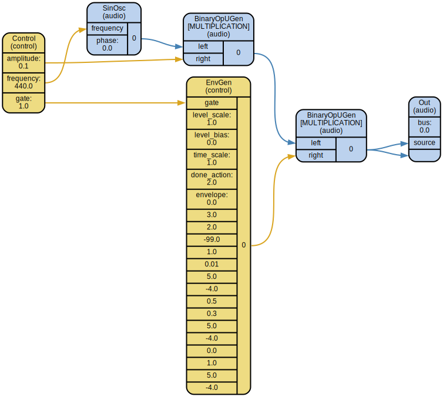

# Supriya

[Supriya](https://github.com/josiah-wolf-oberholtzer/supriya) is a
[Python](https://www.python.org/) API for
[SuperCollider](http://supercollider.github.io/).

Supriya lets you:

- Boot and communicate with SuperCollider's ``scsynth`` synthesis engine:
  [servers](http://josiahwolfoberholtzer.com/supriya/api/supriya/contexts/realtime.html)
  in realtime.

- Compile SuperCollider
  [SynthDefs](http://josiahwolfoberholtzer.com/supriya/api/supriya/synthdefs/index.html)
  natively in Python code

- Explore
  [nonrealtime](http://josiahwolfoberholtzer.com/supriya/api/supriya/contexts/nonrealtime.html)
  composition with scores.

- Build time-agnostic
  [asyncio](https://docs.python.org/3/library/asyncio.html)-aware applications
  with the
  [context](http://josiahwolfoberholtzer.com/supriya/api/supriya/contexts/core.html)
  interface.

- Schedule
  [patterns](http://josiahwolfoberholtzer.com/supriya/api/supriya/patterns/index.html)
  and callbacks with tempo- and meter-aware
  [clocks](http://josiahwolfoberholtzer.com/supriya/api/supriya/clocks/index.html)

- Integrate with [IPython](http://ipython.org/),
  [Sphinx](https://www.sphinx-doc.org/en/master/) and
  [Graphviz](http://graphviz.org/)

## Quickstart

### 1. Get Supriya

Install from PyPI:

    pip install supriya

Or from source:

    git clone https://github.com/josiah-wolf-oberholtzer/supriya.git
    cd supriya
    pip install -e .

### 2. Get SuperCollider

Get SuperCollider from http://supercollider.github.io/.

### 3. Boot the server

Start your Python interpreter and import Supriya:

    >>> import supriya

Boot the SuperCollider server:

    >>> server = supriya.Server().boot()

### 4. Build a SynthDef

Import some classes:

    >>> from supriya.ugens import EnvGen, Out, SinOsc
    >>> from supriya.synthdefs import Envelope, synthdef

Make a synthesizer definition:

    >>> @synthdef()
    ... def simple_sine(frequency=440, amplitude=0.1, gate=1):
    ...     sine = SinOsc.ar(frequency=frequency) * amplitude
    ...     envelope = EnvGen.kr(envelope=Envelope.adsr(), gate=gate, done_action=2)
    ...     Out.ar(bus=0, source=[sine * envelope] * 2)
    ...

Visualize the SynthDef (requires [Graphviz](http://graphviz.org/)):
    
    >>> supriya.graph(simple_sine)

Allocate it on the server:

    >>> _ = server.add_synthdefs(simple_sine)

### 5. Create some nodes

Create and allocate a group:

    >>> group = server.add_group()

Create some synthesizers with the previously defined synthesizer definition, and
allocate them on the server as a child of the previously created group:

    >>> for i in range(3):
    ...     _ = group.add_synth(simple_sine, frequency=111 * (i + 1))
    ...

Query the server's node tree:

    >>> print(server.query_tree())
    NODE TREE 0 group
        1 group
            1000 group
                1003 simple_sine
                    amplitude: 0.1, frequency: 333.0, gate: 1.0
                1002 simple_sine
                    amplitude: 0.1, frequency: 222.0, gate: 1.0
                1001 simple_sine
                    amplitude: 0.1, frequency: 111.0, gate: 1.0

### 6. Release and quit

Release the synths:

    >>> for synth in group.children[:]:
    ...     synth.free()
    ...

Quit the server:

    >>> server.quit()

## License

This library is made available under the terms of the MIT license.
