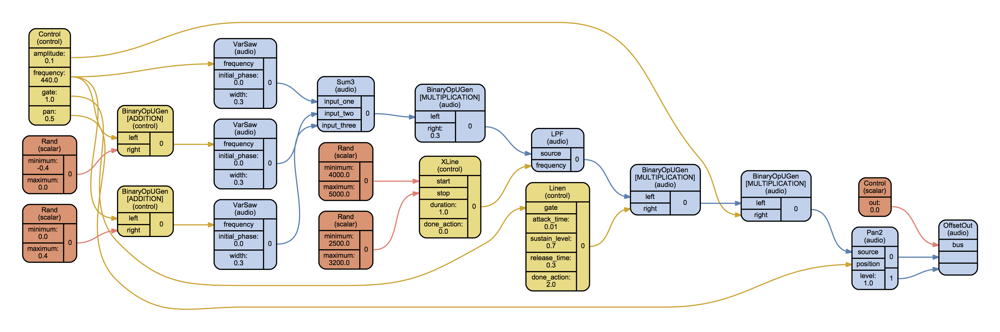

:hero: a Python API for SuperCollider

Supriya (|release|)
===================

`GitHub`_ |
`PyPI`_ |
`Documentation <http://josiahwolfoberholtzer.com/supriya/>`_ |
`Issue Tracker <https://github.com/josiah-wolf-oberholtzer/supriya/issues>`_

:term:`Supriya` is a :term:`Python` API for :term:`SuperCollider`.

Supriya lets you:

- Boot and communicate with SuperCollider's ``scsynth`` synthesis server in
  realtime

- Compile SynthDefs natively in Python

- Explore non-realtime composition with object-oriented Sessions

- Build time-agnostic asyncio applications with Providers

- Schedule patterns and callbacks with tempo- and meter-aware Clocks

- Integrate with IPython, Sphinx and Graphviz

Supriya is compatible with Python 3.8+ only.



Quickstart
----------

1. Get Supriya
``````````````

.. tab-set::

    .. tab-item:: From PyPI

        ::

            ~$ pip install supriya

    .. tab-item:: From GitHub

        ::

            ~$ git clone https://github.com/josiah-wolf-oberholtzer/supriya.git
            ~$ cd supriya
            supriya$ pip install -e .

.. note::

    Consult our installation instructions for detailed help on getting Supriya,
    setting it up, and installing any additional dependencies like `Graphviz`_.

2. Get SuperCollider
````````````````````

Get `SuperCollider`_ from http://supercollider.github.io/.

3. Boot the server
``````````````````

Start your Python interpreter and import Supriya::

    >>> import supriya

Boot the SuperCollider server::

    >>> server = supriya.Server().boot()

3. Build a :term:`SynthDef`
```````````````````````````

Make a synthesizer definition::

    >>> builder = supriya.SynthDefBuilder(
    ...     amplitude=1.0,
    ...     frequency=440.0,
    ...     gate=1.0,
    ... )

::

    >>> with builder:
    ...     source = supriya.ugens.SinOsc.ar(
    ...         frequency=builder['frequency'],
    ...     )
    ...     envelope = supriya.ugens.EnvGen.kr(
    ...         done_action=supriya.DoneAction.FREE_SYNTH,
    ...         envelope=supriya.Envelope.asr(),
    ...         gate=builder['gate'],
    ...     )
    ...     source = source * builder['amplitude']
    ...     source = source * envelope
    ...     out = supriya.ugens.Out.ar(
    ...         bus=0,
    ...         source=source,
    ...     )

::

    >>> synthdef = builder.build()

Visualize the SynthDef (requires `Graphviz`_)::
    
    >>> supriya.graph(synthdef)

Allocate it on the server::

    >>> _ = server.add_synthdef(synthdef)

4. Create some nodes
````````````````````

Create and allocate a group::

    >>> group = server.add_group()

Synchronize with the server::

    >>> server.sync()

Create some synthesizers with the previously defined synthesizer definition, and
allocate them on the server as a child of the previously created group::

    >>> for i in range(3):
    ...     _ = group.add_synth(synthdef=synthdef, frequency=111 * (i + 1))
    ...

Query the server's node tree::

    >>> print(server.query())

Visualize the server's node tree::

    >>> supriya.graph(server)

5. Release and quit
```````````````````

Release the synths::

    >>> for synth in group[:]:
    ...    synth.release()
    ...

Quit the server::

    >>> server.quit()

Dive in deeper
--------------

.. toctree::
    :caption: Getting Started

    installation
    concepts

.. toctree::
    :caption: Tutorials

    realtime/index
    nonrealtime/index
    osc
    synthdefs/index
    providers
    clocks
    patterns

.. toctree::
    :caption: How-to Guides
    :glob:

    guides/*

.. toctree::
    :caption: API
    :maxdepth: 2

    api/supriya/index

.. toctree::
    :caption: For Developers

    cicd
    ipython
    sphinx
    graphviz

.. toctree::
    :caption: Reference

    glossary

Index
-----
:ref:`genindex`

..  _Cython: https://cython.org/
..  _GitHub: https://github.com/josiah-wolf-oberholtzer/supriya
..  _Graphviz: http://graphviz.org/
..  _Homebrew: http://brew.sh/
..  _IPython: https://ipython.org/
..  _PyPI: https://pypi.python.org/pypi
..  _Python: https://www.python.org/
..  _SuperCollider: http://supercollider.github.io/
..  _Supriya: https://github.com/josiah-wolf-oberholtzer/supriya
..  _libsndfile: http://www.mega-nerd.com/libsndfile/
..  _pip: https://pip.pypa.io/en/stable/
..  _python-rtmidi: https://github.com/SpotlightKid/python-rtmidi
..  _virtualenv: https://readthedocs.org/projects/virtualenv/
..  _virtualenvwrapper: https://virtualenvwrapper.readthedocs.org/en/latest/
..  _wavefile: https://pypi.python.org/pypi/wavefile/
